<div align="center">



<p>
  
  
  
</p>

<p><a href="README.md">English</a> &nbsp;|&nbsp; <b>Español</b></p>

</div>


## El problema

Descargar un archivo de 10 GB desde el navegador falla con frecuencia: el servidor limita la velocidad de cada conexión, la sesión se corta y, al reintentar, todo empieza desde cero.

Este repositorio contiene **un único script de Python** (`descargar_zenodo.py`) que resuelve esos problemas:

| Problema | Solución |
|---|---|
| Servidor lento por conexión | Varias conexiones simultáneas, cada una con un rango de bytes distinto |
| Cortes de red | Reintentos automáticos con espera exponencial |
| Empezar de cero tras un fallo | Estado guardado en disco; se reanuda desde el último segmento completo |
| Archivo corrupto sin saberlo | Verificación MD5 contra la suma publicada por Zenodo |

Viene configurado por defecto para el registro
[zenodo.org/records/8280431](https://zenodo.org/records/8280431)
(*A pulse crop dataset of agronomic traits and multispectral images from multiple environments*, archivo `Images.zip`, unos 10.8 GB), pero funciona con cualquier archivo de Zenodo o de cualquier servidor que acepte descargas por rangos.


## Inicio rápido

Necesitas Python 3.8 o superior. No hay nada que instalar.

```bash
# 1. Obtener el script
git clone https://github.com/jf-floresriera/zenodo-resume-downloader.git
cd zenodo-resume-downloader

# 2. Descargar Images.zip (registro 8280431) en la carpeta actual
python descargar_zenodo.py
```

En Windows puedes usar `py descargar_zenodo.py` desde PowerShell o CMD.

Si la descarga se interrumpe por cualquier motivo (corte de internet, cierre de la terminal, `Ctrl+C`, apagado del equipo), **ejecuta exactamente el mismo comando** y continuará donde quedó.

<div align="center">

</div>

<sub>La animación es una ilustración del formato de salida; las cifras de avance no corresponden a una medición real.</sub>

Los mensajes del programa siguen el idioma de tu sistema (español o inglés). Puedes forzarlo con `--lang es` o `--lang en`.


## Cómo funciona

El archivo se divide en segmentos de tamaño fijo (8 MiB por defecto). Un grupo de hilos toma segmentos pendientes y pide cada uno con la cabecera HTTP `Range: bytes=inicio-fin`. Cada segmento se escribe directamente en su posición dentro de `Images.zip.part`, un archivo que se reserva desde el comienzo con su tamaño final.

<div align="center">

</div>

Cada vez que un segmento termina, se anota en `Images.zip.estado.json`. Ese archivo se escribe de forma atómica, por lo que un corte de luz no lo daña.

### Reanudación

Al iniciar, el script compara el estado guardado con el archivo remoto (URL y tamaño). Si coinciden, salta los segmentos ya completos. Un segmento interrumpido a la mitad se retoma desde el último byte recibido mientras el programa siga vivo; si se cerró el programa, solo se repite ese segmento (unos pocos MB, no el archivo entero).

<div align="center">

</div>

### Verificación

Al terminar se calcula el MD5 del archivo y se compara con el publicado por Zenodo. Solo si coincide, `Images.zip.part` se renombra a `Images.zip` y se elimina el archivo de estado.


## Opciones

```text
python descargar_zenodo.py [URL] [opciones]
```

| Opción | Descripción | Por defecto |
|---|---|---|
| `URL` | Enlace directo del archivo | `Images.zip` del registro 8280431 |
| `-o`, `--salida DIR` | Carpeta de destino | carpeta actual |
| `-n`, `--conexiones N` | Conexiones simultáneas | `4` |
| `--segmento-mb MB` | Tamaño de cada segmento en MiB | `8` |
| `--reintentos N` | Reintentos consecutivos por segmento | `8` |
| `--timeout SEC` | Espera máxima de red en segundos | `30` |
| `--nombre NAME` | Nombre del archivo final | el de la URL |
| `--md5 SUM` | MD5 esperado (si no, se busca en Zenodo) | automático |
| `--sin-verificar` | Omitir la verificación MD5 | desactivado |
| `--reiniciar` | Borrar el avance guardado y empezar de cero | desactivado |
| `--lang auto/es/en` | Idioma de los mensajes | `auto` |

Ejemplos:

```bash
# Guardar en otra carpeta con 6 conexiones
python descargar_zenodo.py -n 6 -o ~/datos/drones

# Descargar otro archivo de Zenodo
python descargar_zenodo.py "https://zenodo.org/records/<id>/files/<archivo>?download=1"

# Red muy inestable: segmentos más pequeños y más reintentos
python descargar_zenodo.py --segmento-mb 4 --reintentos 15
```

Códigos de salida: `0` correcto, `1` error, `2` el MD5 no coincide, `130` interrumpido por el usuario (el avance queda guardado).


## Cuántas conexiones usar

- Empieza con **4**. Es un buen equilibrio y suele bastar cuando el límite está en la velocidad por conexión.
- Sube a **6 u 8** solo si al pasar de 4 la velocidad total aumenta de forma clara.
- Si el servidor responde con errores `429` o `503`, **baja** el número de conexiones. El script ya espera y reintenta, pero no conviene forzarlo.
- Si el límite está en el ancho de banda total que ofrece el servidor, más conexiones no aceleran nada. En ese caso la ventaja real es la reanudación, no la velocidad.

Zenodo es un servicio público y gratuito operado por el CERN. Usa el mínimo de conexiones que te funcione.


## Después de descargar

Un `.zip` de más de 4 GB normalmente usa el formato ZIP64, así que conviene una herramienta reciente:

```bash
# Linux / macOS
unzip Images.zip -d Images

# Windows: 7-Zip o el explorador de archivos
```

Comprueba que tengas espacio libre para el zip **y** para su contenido descomprimido.

## Solución de problemas

| Síntoma | Causa probable y acción |
|---|---|
| `Espacio insuficiente` | El disco no tiene lugar para el archivo completo. Libera espacio o usa `-o` con otro disco. |
| `HTTP 429` / `HTTP 503` repetidos | El servidor pide bajar el ritmo. Reduce `-n` y vuelve a ejecutar. |
| `Se agotaron los reintentos` | Corte prolongado. El avance está guardado; ejecuta el mismo comando. |
| `MD5 distinto` | Archivo corrupto. Ejecuta con `--reiniciar`. |
| `No se encontró un MD5 de referencia` | La API de Zenodo no respondió. La descarga sigue; puedes pasar la suma con `--md5`. |
| `El avance guardado no coincide` | Cambió el archivo remoto o la URL. El script empieza de cero de forma segura. |
| Quiero borrar todo lo parcial | Elimina `Images.zip.part` y `Images.zip.estado.json`. |

## Alternativas

Si prefieres herramientas ya existentes, estas también reanudan y paralelizan:

```bash
# aria2: 4 conexiones, reanuda con -c
aria2c -c -x 4 -s 4 -k 8M -o Images.zip "https://zenodo.org/records/8280431/files/Images.zip?download=1"

# curl: una conexión, reanuda con -C -
curl -L -C - -o Images.zip "https://zenodo.org/records/8280431/files/Images.zip?download=1"
```

La ventaja de este script es que funciona sin instalar nada más que Python, muestra un progreso claro y verifica el MD5 automáticamente.


## Prueba local

Hay una prueba de extremo a extremo que no necesita internet. Levanta un servidor con soporte de rangos y velocidad limitada, interrumpe la descarga a la mitad, la reanuda y comprueba que el archivo final es idéntico al original:

```bash
python tests/prueba_local.py
```

## Estructura del repositorio

```text
.
|-- descargar_zenodo.py      # el descargador (un solo archivo, sin dependencias)
|-- tests/
|   `-- prueba_local.py      # prueba de reanudación e integridad
|-- assets/                  # ilustraciones animadas del README (SVG, es/en)
|-- LICENSE
|-- README.md                # English
`-- README.es.md             # Español
```

## Datos y citación

Este repositorio **no contiene ni redistribuye** el conjunto de datos; solo ayuda a descargarlo desde su fuente oficial. Revisa la licencia y las condiciones de uso en la página del registro, y cita el trabajo original:

> *A pulse crop dataset of agronomic traits and multispectral images from multiple environments.* Zenodo. DOI: [10.5281/zenodo.8280431](https://doi.org/10.5281/zenodo.8280431)

## Licencia

El código de este repositorio se distribuye bajo licencia MIT (ver `LICENSE`). La licencia de los datos descargados es la que indique su autor en Zenodo.
