<div align="center">



<p>
  
  
  
</p>

<p><b>English</b> &nbsp;|&nbsp; <a href="README.es.md">Español</a></p>

</div>


## The problem

Downloading a 10 GB file from the browser often fails: the server limits the speed of each connection, the session drops, and when you retry everything starts from zero.

This repository ships **a single Python script** (`descargar_zenodo.py`) that fixes those problems:

| Problem | Solution |
|---|---|
| Server is slow per connection | Several simultaneous connections, each requesting a different byte range |
| Network drops | Automatic retries with exponential backoff |
| Starting over after a failure | Progress saved on disk; resumes from the last complete segment |
| Silent file corruption | MD5 verification against the checksum published by Zenodo |

It is preconfigured for the record
[zenodo.org/records/8280431](https://zenodo.org/records/8280431)
(*A pulse crop dataset of agronomic traits and multispectral images from multiple environments*, file `Images.zip`, about 10.8 GB), but it works with any Zenodo file, or any server that supports range requests.


## Quick start

You need Python 3.8 or newer. There is nothing to install.

```bash
# 1. Get the script
git clone https://github.com/jf-floresriera/zenodo-resume-downloader.git
cd zenodo-resume-downloader

# 2. Download Images.zip (record 8280431) into the current folder
python descargar_zenodo.py
```

On Windows you can use `py descargar_zenodo.py` from PowerShell or CMD.

If the download stops for any reason (network loss, closed terminal, `Ctrl+C`, shutdown), **run exactly the same command again** and it continues where it stopped.

<div align="center">

</div>

<sub>The animation is an illustration of the output format; the progress figures are not a real measurement.</sub>

The program messages follow your system language (Spanish or English). Force one with `--lang es` or `--lang en`.


## How it works

The file is split into fixed-size segments (8 MiB by default). A pool of threads takes pending segments and requests each one with the HTTP header `Range: bytes=start-end`. Each segment is written directly at its position inside `Images.zip.part`, a file reserved at its final size from the start.

<div align="center">

</div>

Whenever a segment finishes, it is recorded in `Images.zip.estado.json`. That file is written atomically, so a power cut cannot corrupt it.

### Resuming

On start, the script compares the saved state with the remote file (URL and size). If they match, it skips the completed segments. A segment interrupted halfway resumes from the last byte received while the program is alive; if the program was closed, only that segment is repeated (a few MB, not the whole file).

<div align="center">

</div>

### Verification

When finished, the MD5 of the file is computed and compared with the one published by Zenodo. Only if they match is `Images.zip.part` renamed to `Images.zip` and the state file removed.


## Options

```text
python descargar_zenodo.py [URL] [options]
```

| Option | Description | Default |
|---|---|---|
| `URL` | Direct link to the file | `Images.zip` from record 8280431 |
| `-o`, `--salida DIR` | Destination folder | current folder |
| `-n`, `--conexiones N` | Simultaneous connections | `4` |
| `--segmento-mb MB` | Size of each segment in MiB | `8` |
| `--reintentos N` | Consecutive retries per segment | `8` |
| `--timeout SEC` | Network timeout in seconds | `30` |
| `--nombre NAME` | Final file name | taken from the URL |
| `--md5 SUM` | Expected MD5 (otherwise looked up on Zenodo) | automatic |
| `--sin-verificar` | Skip the MD5 verification | off |
| `--reiniciar` | Delete saved progress and start over | off |
| `--lang auto/es/en` | Message language | `auto` |

The option names are in Spanish for historical reasons; their meaning is listed above.

Examples:

```bash
# Save elsewhere using 6 connections
python descargar_zenodo.py -n 6 -o ~/data/drones

# Download another Zenodo file
python descargar_zenodo.py "https://zenodo.org/records/<id>/files/<file>?download=1"

# Very unstable network: smaller segments and more retries
python descargar_zenodo.py --segmento-mb 4 --reintentos 15
```

Exit codes: `0` success, `1` error, `2` MD5 mismatch, `130` interrupted by the user (progress is kept).


## How many connections

- Start with **4**. It is a good balance and usually enough when the limit is the speed per connection.
- Go to **6 or 8** only if total speed clearly improves beyond 4.
- If the server answers with `429` or `503` errors, **lower** the number. The script already waits and retries, but do not push it.
- If the limit is the server's total bandwidth, more connections will not speed anything up. In that case the real benefit is resuming, not speed.

Zenodo is a free public service run by CERN. Use the minimum number of connections that works for you.


## After downloading

A `.zip` over 4 GB normally uses the ZIP64 format, so use a recent tool:

```bash
# Linux / macOS
unzip Images.zip -d Images

# Windows: 7-Zip or File Explorer
```

Make sure you have free space for the zip **and** for its extracted contents.

## Troubleshooting

| Symptom | Likely cause and action |
|---|---|
| `Not enough disk space` | The disk cannot hold the full file. Free space or use `-o` with another drive. |
| Repeated `HTTP 429` / `HTTP 503` | The server asks you to slow down. Lower `-n` and run again. |
| `Retries exhausted` | Long outage. Progress is saved; run the same command. |
| `MD5 mismatch` | Corrupted file. Run with `--reiniciar`. |
| `No reference MD5 found` | Zenodo's API did not answer. The download continues; pass the sum with `--md5`. |
| `Saved progress does not match` | The remote file or URL changed. The script safely starts over. |
| I want to wipe partial data | Delete `Images.zip.part` and `Images.zip.estado.json`. |

## Alternatives

If you prefer existing tools, these also resume and parallelize:

```bash
# aria2: 4 connections, resume with -c
aria2c -c -x 4 -s 4 -k 8M -o Images.zip "https://zenodo.org/records/8280431/files/Images.zip?download=1"

# curl: single connection, resume with -C -
curl -L -C - -o Images.zip "https://zenodo.org/records/8280431/files/Images.zip?download=1"
```

This script's advantage is that it needs nothing besides Python, shows clear progress and verifies the MD5 automatically.


## Local test

There is an end-to-end test that needs no internet. It starts a server with range support and limited speed, interrupts the download halfway, resumes it, and checks that the final file is identical to the original:

```bash
python tests/prueba_local.py
```

## Repository layout

```text
.
|-- descargar_zenodo.py      # the downloader (single file, no dependencies)
|-- tests/
|   `-- prueba_local.py      # resume and integrity test
|-- assets/                  # animated README illustrations (SVG, es/en)
|-- LICENSE
|-- README.md                # English
`-- README.es.md             # Español
```

## Data and citation

This repository **does not contain or redistribute** the dataset; it only helps download it from its official source. Check the license and terms of use on the record page, and cite the original work:

> *A pulse crop dataset of agronomic traits and multispectral images from multiple environments.* Zenodo. DOI: [10.5281/zenodo.8280431](https://doi.org/10.5281/zenodo.8280431)

## License

The code in this repository is released under the MIT license (see `LICENSE`). The license of the downloaded data is the one its author states on Zenodo.
