<div align="center">



<br>

!\[Python](https://img.shields.io/badge/python-3.8%2B-3B6EA5?style=for-the-badge\&labelColor=0A111C)
!\[Dependencias](https://img.shields.io/badge/dependencias-ninguna-2A9D8F?style=for-the-badge\&labelColor=0A111C)
!\[Licencia](https://img.shields.io/badge/licencia-MIT-8FA6BF?style=for-the-badge\&labelColor=0A111C)

</div>


## El problema

Descargar un archivo de 10 GB desde el navegador falla con frecuencia: el servidor limita la velocidad de cada conexion, la sesion se corta y, al reintentar, todo empieza desde cero.

Este repositorio contiene **un unico script de Python** (`descargar\_zenodo.py`) que resuelve esos tres puntos:

|Problema|Solucion|
|-|-|
|Servidor lento por conexion|Varias conexiones simultaneas, cada una con un rango de bytes distinto|
|Cortes de red|Reintentos automaticos con espera exponencial|
|Empezar de cero tras un fallo|Estado guardado en disco; se reanuda desde el ultimo segmento completo|
|Archivo corrupto sin saberlo|Verificacion MD5 contra la suma publicada por Zenodo|

Viene configurado por defecto para el registro
[zenodo.org/records/8280431](https://zenodo.org/records/8280431)
(*A pulse crop dataset of agronomic traits and multispectral images from multiple environments*, archivo `Images.zip`, 10.8 GB), pero funciona con cualquier archivo de Zenodo o de cualquier servidor que acepte descargas por rangos.


## Inicio rapido

Necesitas Python 3.8 o superior. No hay nada que instalar.

```bash
# 1. Obtener el script
git clone https://github.com/<jf-floresriera>/zenodo-resume-downloader.git
cd zenodo-resume-downloader

# 2. Descargar Images.zip (registro 0000) en la carpeta actual
python descargar\_zenodo.py
```

En Windows puedes usar `py descargar\_zenodo.py` desde PowerShell o CMD.

Si la descarga se interrumpe por cualquier motivo (corte de internet, cierre de la terminal, `Ctrl+C`, apagado del equipo), **ejecuta exactamente el mismo comando** y continuara donde quedo.

<div align="center">

</div>

<sub>La animacion es una ilustracion del formato de salida; las cifras no corresponden a una medicion real.</sub>


## Como funciona

El archivo se divide en segmentos de tamano fijo (8 MiB por defecto). Un grupo de hilos toma segmentos pendientes y pide cada uno con la cabecera HTTP `Range: bytes=inicio-fin`. Cada segmento se escribe directamente en su posicion dentro de `Images.zip.part`, un archivo que se reserva desde el comienzo con su tamano final.

<div align="center">

</div>

Cada vez que un segmento termina, se anota en `Images.zip.estado.json`. Ese archivo se escribe de forma atomica, por lo que un corte de luz no lo daña.

### Reanudacion

Al iniciar, el script compara el estado guardado con el archivo remoto (URL y tamano). Si coinciden, salta los segmentos ya completos. Un segmento interrumpido a la mitad se retoma desde el ultimo byte recibido mientras el programa siga vivo; si se cerro el programa, solo se repite ese segmento (unos pocos MB, no el archivo entero).

<div align="center">

</div>

### Verificacion

Al terminar se calcula el MD5 del archivo y se compara con el publicado por Zenodo. Solo si coincide, `Images.zip.part` se renombra a `Images.zip` y se elimina el archivo de estado.


## Opciones

```text
python descargar\_zenodo.py \[URL] \[opciones]
```

|Opcion|Descripcion|Por defecto|
|-|-|-|
|`URL`|Enlace directo del archivo|`Images.zip` del registro 8280431|
|`-o`, `--salida CARPETA`|Carpeta de destino|carpeta actual|
|`-n`, `--conexiones N`|Conexiones simultaneas|`4`|
|`--segmento-mb MB`|Tamano de cada segmento en MiB|`8`|
|`--reintentos N`|Reintentos consecutivos por segmento|`8`|
|`--timeout SEG`|Espera maxima de red en segundos|`30`|
|`--nombre NOMBRE`|Nombre del archivo final|el de la URL|
|`--md5 SUMA`|MD5 esperado (si no, se busca en Zenodo)|automatico|
|`--sin-verificar`|Omitir la verificacion MD5|desactivado|
|`--reiniciar`|Borrar el avance guardado y empezar de cero|desactivado|

Ejemplos:

```bash
# Guardar en otra carpeta con 6 conexiones
python descargar\_zenodo.py -n 6 -o \~/datos/drones

# Descargar otro archivo de Zenodo
python descargar\_zenodo.py "https://zenodo.org/records/<id>/files/<archivo>?download=1"

# Red muy inestable: segmentos mas pequenos y mas reintentos
python descargar\_zenodo.py --segmento-mb 4 --reintentos 15
```

Codigos de salida: `0` correcto, `1` error, `2` el MD5 no coincide, `130` interrumpido por el usuario (el avance queda guardado).


## Cuantas conexiones usar

* Empieza con **4**. Es un buen equilibrio y suele bastar cuando el limite esta en la velocidad por conexion.
* Sube a **6 u 8** solo si al pasar de 4 la velocidad total aumenta de forma clara.
* Si el servidor responde con errores `429` o `503`, **baja** el numero de conexiones. El script ya espera y reintenta, pero no conviene forzarlo.
* Si el limite esta en el ancho de banda total que ofrece el servidor, mas conexiones no aceleran nada. En ese caso la ventaja real del script es la reanudacion, no la velocidad.

Zenodo es un servicio publico y gratuito mantenido por CERN. Usa el minimo de conexiones que te funcione.


## Despues de descargar

Un `.zip` de mas de 4 GB normalmente usa el formato ZIP64, asi que conviene una herramienta reciente:

```bash
# Linux / macOS
unzip Images.zip -d Images

# Windows: 7-Zip o el explorador de archivos
```

Comprueba que tengas espacio libre para el zip **y** para su contenido descomprimido.

## Solucion de problemas

|Sintoma|Causa probable y accion|
|-|-|
|`Espacio insuficiente`|El disco no tiene lugar para el archivo completo. Libera espacio o usa `-o` con otro disco.|
|`HTTP 429` / `HTTP 503` repetidos|El servidor pide bajar el ritmo. Reduce `-n` y vuelve a ejecutar.|
|`Se agotaron los reintentos`|Corte prolongado. El avance esta guardado; ejecuta el mismo comando.|
|`MD5 distinto`|Archivo corrupto. Ejecuta con `--reiniciar`.|
|`No se encontro un MD5 de referencia`|La API de Zenodo no respondio. La descarga sigue; puedes pasar la suma con `--md5`.|
|`El avance guardado no coincide`|Cambio el archivo remoto o la URL. El script empieza de cero de forma segura.|
|Quiero borrar todo lo parcial|Elimina `Images.zip.part` y `Images.zip.estado.json`.|

## Alternativas

Si prefieres herramientas ya existentes, estas tambien reanudan y paralelizan:

```bash
# aria2: 4 conexiones, reanuda con -c
aria2c -c -x 4 -s 4 -k 8M -o Images.zip "https://zenodo.org/records/8280431/files/Images.zip?download=1"

# curl: una conexion, reanuda con -C -
curl -L -C - -o Images.zip "https://zenodo.org/records/8280431/files/Images.zip?download=1"
```

La ventaja de este script es que funciona sin instalar nada mas que Python, muestra progreso claro y verifica el MD5 automaticamente.


## Prueba local

Hay una prueba de extremo a extremo que no necesita internet. Levanta un servidor con soporte de rangos y velocidad limitada, interrumpe la descarga a la mitad, la reanuda y comprueba que el archivo final es identico al original:

```bash
python tests/prueba\_local.py
```

## Estructura del repositorio

```text
.
|-- descargar\_zenodo.py      # el descargador (un solo archivo, sin dependencias)
|-- tests/
|   `-- prueba\_local.py      # prueba de reanudacion e integridad
|-- assets/                  # ilustraciones animadas del README (SVG)
|-- LICENSE
`-- README.md
```

## Datos y citacion

Este repositorio **no contiene ni redistribuye** el conjunto de datos; solo ayuda a descargarlo desde su fuente oficial. Revisa la licencia y las condiciones de uso en la pagina del registro, y cita el trabajo original:

> \*A pulse crop dataset of agronomic traits and multispectral images from multiple environments.\* Zenodo. DOI: \[10.5281/zenodo.8280431](https://doi.org/10.5281/zenodo.8280431)

## Licencia

El codigo de este repositorio se distribuye bajo licencia MIT (ver `LICENSE`). La licencia de los datos descargados es la que indique su autor en Zenodo.


<details>
<summary><b>English summary</b></summary>

<br>

`descargar\_zenodo.py` is a dependency-free Python 3.8+ script that downloads large files (such as the 10.8 GB `Images.zip` from Zenodo record 8280431) using parallel HTTP range requests, automatic retries with exponential backoff, on-disk progress tracking so an interrupted download resumes where it stopped, and MD5 verification at the end.

```bash
python descargar\_zenodo.py                 # default record, 4 connections
python descargar\_zenodo.py -n 6 -o ./data  # 6 connections, custom folder
```

Rerun the exact same command after any interruption to resume. Please use a modest number of connections: Zenodo is a shared public service. Command-line messages are in Spanish.

</details>

